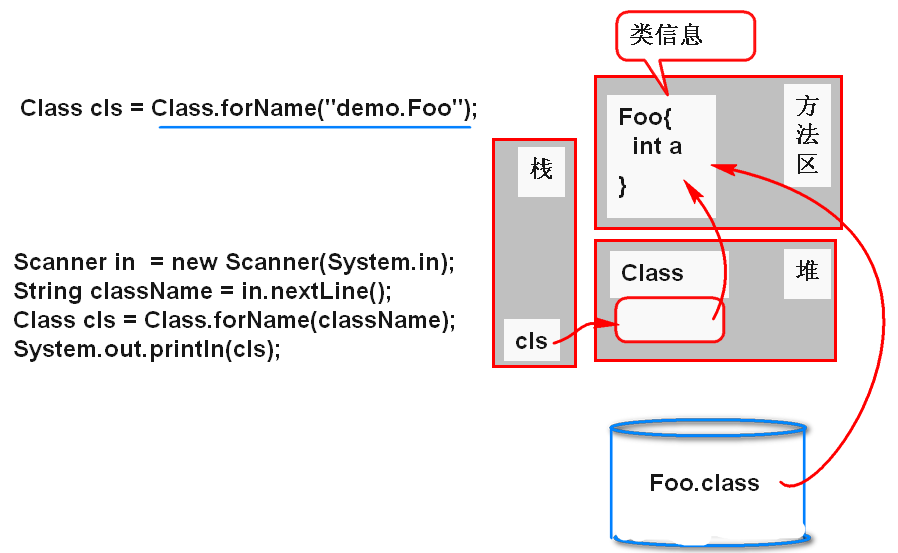
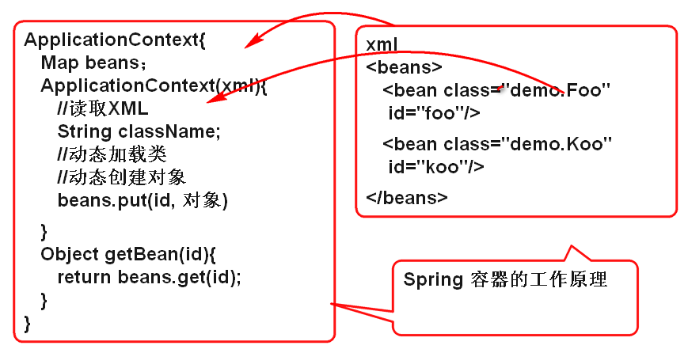

# 反射 （Reflect）

Java 的一套内置API，是一套动态执行机制，可以实现动态功能：

- 动态加载类；
- 动态创建对象；
- 动态访问属性；
- 动态调用方法；
- ...

静态：按部就班

	Person you = new Person();
	Person i = new Person();
	i.love(you);

	Person lee = new Person();
	lee.love(lee);

动态：“随需而变” 的执行代码！

在程序运行期间可以动态的加载任意的类，动态的创建任意的对象，访问任意的属性，执行任意的方法。

## 动态加载类

根据任意的（可变的）类名，将这个类名对应的类文件（*.class） 文件加载到内存的方法区。

API
	
	Class cls = Class.forName("类名");
	//forName 将类加载到内存的方法区中
	//cls 引用的对象就是连接到方法区中类信息的API对象。

案例：

	/*
	 * 动态加载类到内存中
	 */
	Scanner in = new Scanner(System.in);
	//运行期间从控制台“动态”获取“类名”
	String className = in.nextLine();
	//在程序运行之前， 是不指定类名是什么的
	/*
	 * 动态加载类到方法区中，当类名错误时候，
	 * 类名对应的磁盘上没有class文件,就发生
	 * 类没有找到异常！
	 */
	Class cls = Class.forName(className);
	//检查加载的结果
	System.out.println(cls); 

### 动态创建对象

在不知道类名的情况下，“动态”加载一个类，并且创建其对象！

API
	
	Class cls = Class.forName(类名);
	//newInstance 动态调用cls引用类信息的无参数构造器创建对象，返回这个创建的对象, 如果类没有无参数构造器将抛出异常！
	Object obj = cls.newInstance();
	System.out.println(obj);

案例：

	Scanner in = new Scanner(System.in);
	//动态加载类
	String className = in.nextLine();
	Class cls = Class.forName(className);
	//动态创建对象
	Object obj = cls.newInstance();
	System.out.println(obj);

### Spring IOC 原理

使用反射API动态得加载配置文件，发现类名，动态加载类，动态创建对象，管理这些对象。

案例：

	<?xml version="1.0" encoding="UTF-8"?>
	<!-- resources/context.xml -->
	<beans>
		<bean id="foo" class="demo.Foo"></bean>
		<bean id="koo" class="demo.Koo"></bean>
		<bean id="date" class="java.util.Date"></bean>
	</beans>

	public class ApplicationContext {
		//beans 用于缓存被管理的对象
		private HashMap<String, Object> beans=
				new HashMap<String, Object>();
		/**
		 * 根据配置文件，初始化容器环境
		 * @param xml
		 */
		public ApplicationContext(String xml) 
			throws Exception {
			/*
			 * 读取遍历配置文件，根据配置文件中的信息
			 * 动态加载类，动态创建对象，将对象缓存到
			 * beans集合中
			 */
			//导入dom4j 读取XML文件
			SAXReader reader = new SAXReader();
			//getClass().getClassLoader()
			//.getResourceAsStream(文件名) 
			// 从"包"中读取文件, 文件在"包"中!!!
			Document doc= reader.read(getClass()
					.getClassLoader()
					.getResourceAsStream(xml));
			//解析XML的内容
			System.out.println(doc.asXML());
			//访问根元素 <beans>
			Element root = doc.getRootElement();
			//查询到 <bean>
			List<Element> list = root.elements();
			//遍历 bean 元素
			for(Element e:list){
				//e代表xml文件中的每个bean元素
				//读取class属性的值，最为类名
				String className=e.attributeValue("class");
				String id = e.attributeValue("id");
				//动态加载类，动态创建对象
				Class cls = Class.forName(className);
				Object obj = cls.newInstance();
				//将对象缓存到beans集合中
				beans.put(id, obj);
				System.out.println(id+":"+obj); 
			}
		}
		
		public Object getBean(String id){
			//从beans集合中查找id对应的对象
			return beans.get(id);
		}
	}

	public class Demo {

		public static void main(String[] args)
			throws Exception {
			String cfg = "context.xml";
			ApplicationContext ctx = 
					new ApplicationContext(cfg);
			Object bean = ctx.getBean("foo");
			System.out.println(bean); 
		}

	}	

### 获取类的相关信息

利用反射API，可以获取类中声明的所有相关信息。

- 在类中声明的属性
- 在类中声明的方法
- 在类中声明的构造器
- ...

获取属性信息API 
	
	Class cls = ...
	Field[] flds = cls.getDeclaredFields();

案例：

	//动态检查一个类的属性信息
	Scanner in = new Scanner(System.in);
	String className = in.nextLine();
	Class cls = Class.forName(className);
	Field[] flds = cls.getDeclaredFields();
	for(Field f: flds){
		//f 代表 类中的每个属性信息
		System.out.println(f); 
	}

获取方法信息API 
	
	//获取类中的方法信息
	Method[] methods = 
		cls.getDeclaredMethods();
	
案例：
	
	//动态加载类
	Scanner  in = new Scanner(System.in);
	String className = in.nextLine();
	//forName() 加载类的时候，如果多次执行
	// 方法加载类，实际上只加载一次
	Class cls = Class.forName(className);
	//动态获取类的方法信息
	Method[] methods = 
		cls.getDeclaredMethods();
	for(Method m:methods){
		System.out.println(m); 
	}

### 经典案例

模拟实现JUnit3 功能：执行一个类中全部以test为开通方法
注意：类有无参数构造器，方法是无参数的方法。

> 分析：因为需要运行期间动态分析类的相关信息，必须使用反射API实现！

思路：

1. 动态加载类
2. 找到全部方法信息
3. 遍历全部的方法信息，找到以test为开通的方法。
4. 执行无参数的test方法。

代码：

	//找到一个类中以test为开头方法
	Scanner in = new Scanner(System.in);
	String className = in.nextLine();
	Class cls = Class.forName(className);
	Method[] methods =
		cls.getDeclaredMethods();
	Object obj = cls.newInstance();
	for(Method m:methods){
		//getName() 获取方法信息中的方法名
		String name = m.getName();
		if(name.startsWith("test")){
			//m 是以test为开头方法
			System.out.println(m); 
			//num 代表一个方法的参数个数
			int num = 
				m.getParameterTypes().length;
			if(num==0){
				//执行以test为开头的方法
				Object val=m.invoke(obj);
				System.out.println(val); 
			}
		}
	}

	

### 动态执行方法API

Method 类上提供了“动态执行方法”的方法

动态执行方法 API 
	
	//invoke: 调用
	method.invoke(对象, 方法参数...)
	//在这个对象上执行method对应的方法
	//假设 method 代表 test1方法
	//将对象 是 obj
	//这样调用invoke相当于 obj.test1()

## 反射总结

1. 反射是Java的一套API，提供了Java的动态执行功能
2. 反射不能乱用
	- 反射API执行效率低，尽量不用
	- 如果必须动态功能，再使用！
		- 不知道类名，方法名，属性名...
3. 反射必须了解API
	- Class.forName()
	- cls.newInstance()
	- m.invoke()
4. 反射API可以访问私有成员！（可以打破封装）

执行私有方法:

	Method m=cls.getDeclaredMethod(
		"add", int.class, String.class)
	//setAccessible 方法可以关闭原有访问控制机制！使不能执行的方法可以执行了！
	m.setAccessible(true);
	m.invoke(obj, 5, "abc");

### 获取一个指定的方法信息

API
 
	Method m=cls.getDeclaredMethod(
		"add", int.class, String.class)
 

阿里云Maven
http://maven.aliyun.com/nexus/content/groups/public/

http://maven.tedu.cn/nexus/content/groups/public/
